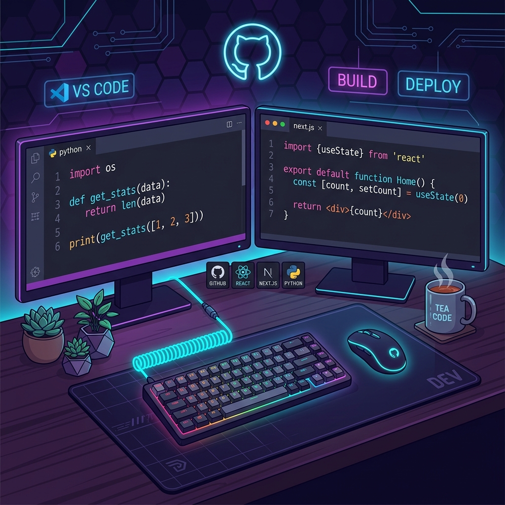

<!-- ======================== HEADER ======================== -->
<div align="center">
  
</div>

<p align="center">
  
</p>

<div align="center">

```javascript
const developer = {
  stack: ["Next.js", "Python", "FastAPI", "Node.js"],
  currently: "Building products @ ClimAgro & EHM 🚀"
};
```

</div>

---

<!-- ======================== ABOUT ME ======================== -->
### 👨‍💻 About Me

<table border="0">
  <tr>
    <td width="65%" valign="top">
      <p>A passionate <b>Software Developer</b> with dual backend capability (Node + Python), deep Next.js expertise, and clean system design fundamentals. I focus on building high-performance, scalable web systems and solving complex problems with efficient Data Structures & Algorithms.</p>
      <ul>
        <li>🌿 <b>Software Developer @ <a href="https://github.com/ashutosh096">ClimAgro Analytics</a></b> — Building AgriTech platforms to empower farmers & analysts (IIT Kanpur funded startup, Technopark, IIT Kanpur).</li>
        <li>🏥 <b>Software Developer @ EHM Consultancy</b> — Architecting scalable healthcare management systems (IIT Kanpur funded startup, Technopark, IIT Kanpur).</li>
        <li>🎓 <b>B.Tech in Computer Science</b> — Passionate about software engineering and systems.</li>
        <li>🏆 Skilled in <b>Data Structures & Algorithms</b> | Competitive programmer at heart.</li>
        <li>⚡ <b>Fun fact</b>: I turn chai ☕ and caffeine into production-ready features!</li>
      </ul>
    </td>
    <td width="35%" align="center" valign="middle">
      
    </td>
  </tr>
</table>

---

<!-- ======================== TECH STACK ======================== -->
## 🛠️ Tech Arsenal

<div align="center">

| **Category** | **Technologies** |
|:---:|:---|
| 🖥️ **Languages** |      |
| 🌐 **Frontend** |     |
| ⚙️ **Backend** |    |
| 🗄️ **Databases** |    |
| 🛠️ **Tools & DevOps** |    |
| ☁️ **Cloud** |   |

</div>

---

<!-- ======================== FEATURED PROJECTS ======================== -->
## 🚀 Featured Projects

<table border="0">
  <tr>
    <td width="33%" valign="top">
      <h3>🌾 <a href="https://github.com/ashutosh096/croprisk">CropRisk.ai</a></h3>
      <p><b>Agricultural Risk Intelligence</b></p>
      <p>An enterprise agricultural risk assessment and crop health analytics dashboard enabling agronomists and crop insurers to track NDVI, canopy temperature, and soil moisture anomalies in real time.</p>
      <p>
        
        
        
      </p>
    </td>
    <td width="33%" valign="top">
      <h3>🌾 <a href="https://github.com/ashutosh096/wheatrisk">WheatRisk.ai</a></h3>
      <p><b>Geospatial Underwriting & Risk DNA</b></p>
      <p>A crop loan risk management system projecting wheat crop failure hazards across Uttar Pradesh, India. Features interactive Crop Hazard Index (CHI) maps, regional Risk DNA comparison, and exposure alerts.</p>
      <p>
        
        
        
      </p>
    </td>
    <td width="33%" valign="top">
      <h3>⚡ <a href="https://github.com/ashutosh096/deploydash">DeployDash</a></h3>
      <p><b>Enterprise Release & Checklist Coordinator</b></p>
      <p>An enterprise-grade release checklist and deployment verification dashboard coordinating workflows, live checklists, and secure email invitation systems for ClimAgro & EHM development teams.</p>
      <p>
        
        
        
      </p>
    </td>
  </tr>
</table>

---

<!-- ======================== GITHUB STATS ======================== -->
## 📊 GitHub Analytics

<div align="center">
  
  
</div>

<div align="center">
  
</div>

<div align="center">
  
</div>

---
---

<!-- ======================== DSA STATS ======================== -->
## 💡 Competitive Programming

<div align="center">

[](https://leetcode.com/ashutosh096/)

</div>

---

<!-- ======================== WHAT I'M WORKING ON ======================== -->
## 🔭 What I'm Building

<table border="0">
  <tr>
    <td width="50%" valign="top">
      <h3>🌿 ClimAgro Analytics</h3>
      <p><b>Software Developer</b> (IIT Kanpur Startup)</p>
      <p>Developing scalable agricultural intelligence and crop risk telemetry dashboards.</p>
    </td>
    <td width="50%" valign="top">
      <h3>🏥 EHM Consultancy</h3>
      <p><b>Software Developer</b> (IIT Kanpur Startup)</p>
      <p>Architecting secure, enterprise-grade healthcare underwriting and release portals.</p>
    </td>
  </tr>
  <tr>
    <td width="50%" valign="top">
      <h3>⚡ Next.js & Python Stack</h3>
      <p><b>Full-Stack Engineering</b></p>
      <p>Building highly responsive web frontends coupled with fast Python-based backend APIs.</p>
    </td>
    <td width="50%" valign="top">
      <h3>📊 DSA Mastery</h3>
      <p><b>Algorithmic Problem Solving</b></p>
      <p>Solving complex data structures and algorithms challenges to optimize efficiency.</p>
    </td>
  </tr>
</table>

---

<!-- ======================== CONNECT ======================== -->
## 🌐 Let's Connect!

<div align="center">

[](https://www.linkedin.com/in/ashutosh-mishra-33b0a4330/)
[](https://github.com/ashutosh096)
[](mailto:ashutoshmishraup78@gmail.com)
[](https://leetcode.com/ashutosh096/)

</div>

---

<!-- ======================== VISITOR COUNT ======================== -->
<div align="center">

### 👀 Profile Views


### 💬 Random Dev Quote

> "Simplicity is the soul of efficiency." — *Austin Freeman*

<br/>

<h3 align="center">umm. ya i kinda like <b>next.js</b> and <b>python</b></h3>
<p align="center"><b>I don't let my schooling interfere with my education</b></p>

</div>

<!-- ======================== FOOTER ======================== -->
<div align="center">


</div>

<div align="center">
  <i>⭐ Star my repos if you find them helpful! Happy coding! 🚀</i>
</div>
